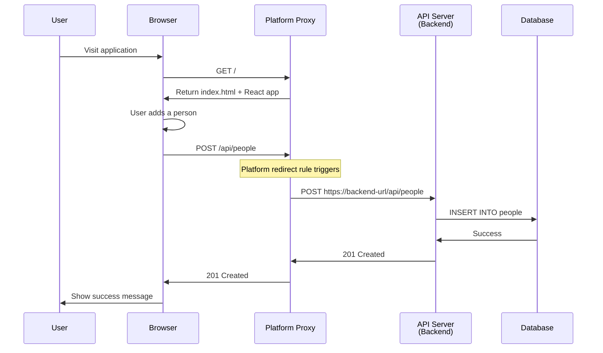
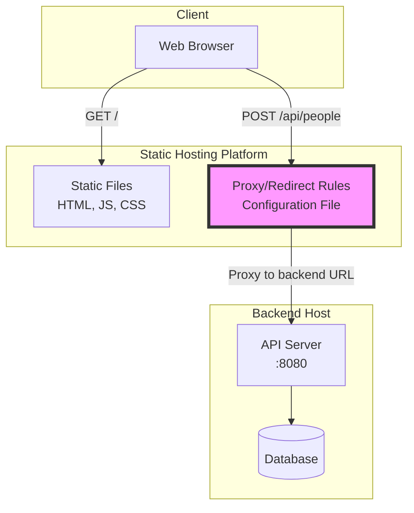

# Reverse Proxy Architecture

This document explains how the reverse proxy works in different deployment scenarios for the Christmas Gift List application.

## Overview

The frontend is a static React application that needs to communicate with the backend API. Since they are deployed separately, we need reverse proxies to route API requests from the frontend to the backend.

## Reverse Proxy Flow

### Platform-Level Proxy (Production Deployment)



## Architecture Diagrams

### Platform-Level Proxy (Managed Hosting)



## Request Routing Matrix

| Scenario             | Request Path  | Proxy Configuration     | Backend URL                        | How It Works                         |
| -------------------- | ------------- | ----------------------- | ---------------------------------- | ------------------------------------ |
| **Platform Hosting** | `/api/people` | Platform redirect rules | `https://backend-url/api/people`   | Platform CDN intercepts and forwards |
| **Docker Compose**   | `/api/people` | Web server config file  | `http://backend:8080/api/people`   | Reverse proxy within Docker network  |
| **Local Dev Server** | `/api/people` | Dev server proxy config | `http://localhost:8080/api/people` | Dev server built-in proxy            |

## Implementation Details

### Platform-Level Proxy Configuration

**Configuration file location:** Root of project or platform-specific location

**Example configuration:**

```
# Redirect/proxy rule
from = "/api/*"
to = "https://your-backend-url/api/:splat"
status = 200      # Return backend response (not redirect)
force = true      # Override other rules
```

**How it works:**

1. User visits the application
2. React app loads in browser
3. App makes request to `/api/people`
4. Platform CDN intercepts the request
5. Rewrites URL to backend URL
6. Forwards request to backend
7. Returns backend response to browser
8. Browser thinks it came from same origin
